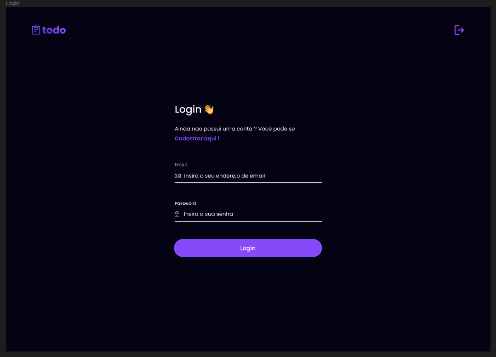
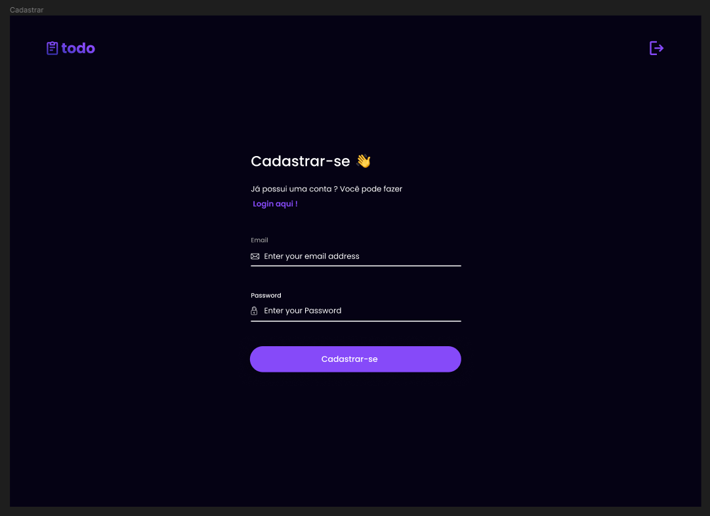
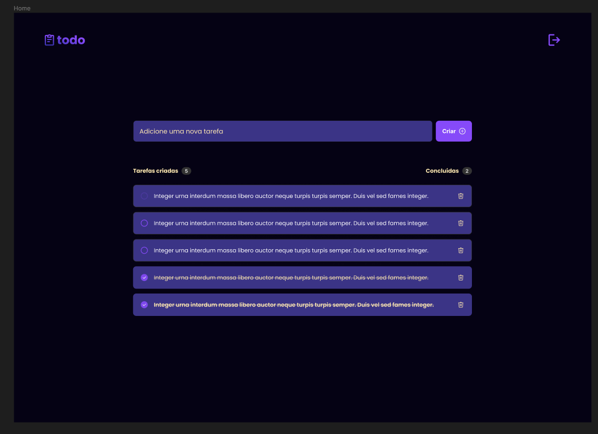

<h1>Gerencie suas tarefas de forma fácil</h1>

 
 
 

## 📦 Tecnologias usadas:

- 
- 
- 
- 

## Demo

<a href="https://to-do-eta-three.vercel.app/" target="_blank">Link do Projeto</a>
<a href="https://www.figma.com/file/AM4tRXGtY3SFBvMpm2zgto/todo?type=design&node-id=0%3A1&mode=design&t=dU74D5Jwkcf0elts-1" target="_blank">Link do Figma</a>

